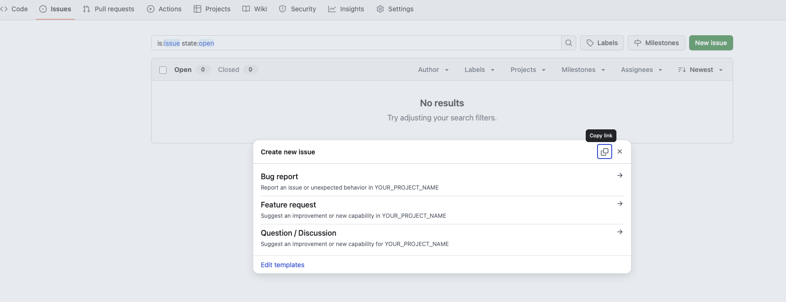

# GitHub issue templates

[](LICENSE)
[](https://github.com/jmeiracorbal/issue_templates/issues)
[](https://github.com/jmeiracorbal/issue_templates/commits/main)

A few issue templates to use along the way that i use on my projects in GitHub:

- Bug report template.
- Feature request template.
- Question/discussion template.
- Configuration file (`config.yml`) to organize templates and contact links.

## Usage

How to use these templates in another repository:

1. Copy the `.github/ISSUE_TEMPLATE/` directory into your target repository.
2. Update the content or labels if needed.
3. GitHub will automatically show these templates when opening a new issue.

_Note_: you must add the `config.yml` so it can be found on issue section on your repo when an user open an issue. You must add the `blank_issues_enabled`:

```yml
blank_issues_enabled: false
```

When you creates a new issue, you can select a issue template:



## License

This project is released under the [MIT License](LICENSE). Feel free to use, modify and distribute the templates with or without attribution.